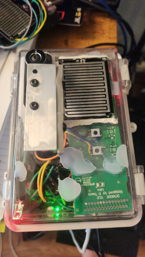
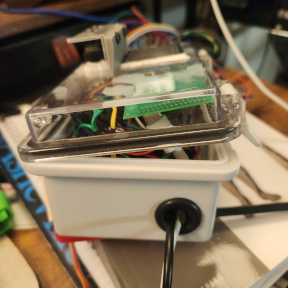
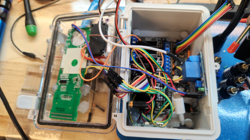

## RainSnsr 🌧️

This project is for software written as an IoT proof of concept using the WildernessLabs Meadow microcontroller. While this project is a "forcing function" to build a backplane for data capture and analysis in our lab, it also has some real-world utility.

## Zooming out

This project will be installed where an [Aleko Motorized Retractable Awning](https://www.alekoproducts.com/outdoor-living/awnings/motorized-awnings) is already in place. The objective is to retract the awning if rain rolls up on that location. A previous awning was lost to a squall last summer so this isn't an empty proof of concept. Beyond being a straight replacement, this model has some additional bells and whistles, such as a remote-controllable light strip on the fixture. The RainSnsr device is both to provide a "backstop" in case of a situation where the owners can't get to the controls before the wind/rain damage the extended awning. In order to do this, we're physically "hacking" an Aleko wireless remote to control the awning directly - separate from the remotes that are already in place on site.

The sensor detects rainfall and retracts the awning through a relay trigger to the hacked remote. There will be some "wall clock" timers on the microcontroller to re-check the sensor at some interval. The wiper controlled by the servo clears any drops of water and a new measurement is taken. If it's dry and the weather report (from OpenWeather API) is conducive then the device re-opens the awning.

### Additional Features

There will be a few things like a "safety" closure of the awning half an hour after sunset. And since the Meadow is WiFi enabled there will be a way to activate/control the awning from anywhere via a secure endpoint. 

