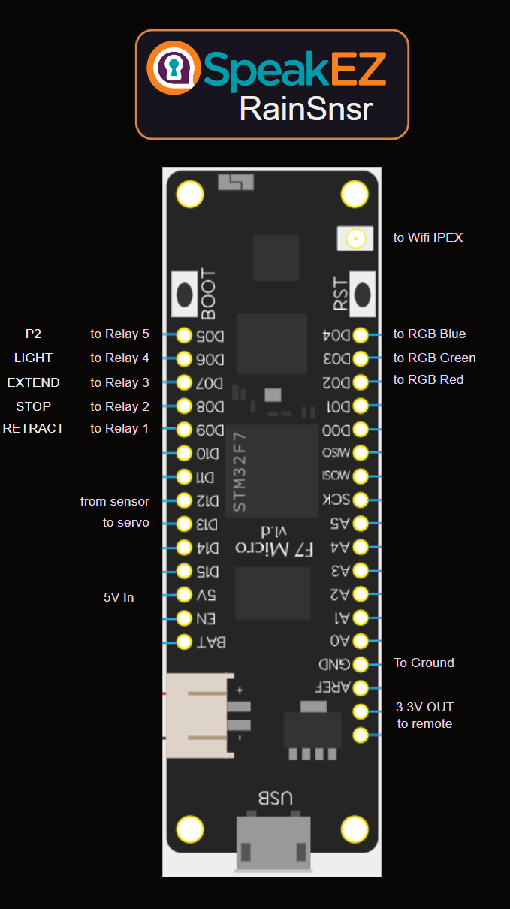

# Pinouts

This diagram shows the basic setup of the Meadow "Feather" and the connections to the various components. Notes are below.

## Diagram

## Notes

The PWM LED was a late addition after I realized that the blue LEDs on the awning remote would likely not be seen in daylight due to its angle and low intensity The idea for the LED is to provide some visual feedback as to what's happening with the unit. 

The relays into the ALEKO four-button remote are aligned for the sake of convenience. Space is tight and the bank of relays have pin inputs for the relays so I used short jumper wires to connect the relay bank inputs to the Feather. 

Connecting to the remote from the relay bank was a solder job at both ends. So as a precaution I added in-line pin connectors in case it came down to removal or replacement of one or the other.

The relay that manages the rain sensor has a bias circuit, and runs as 12V DC. If I had my way I'd probably root around for a 5V DC version but I had this one on hand and it works reasonably well, other than needing a buck converter to step down the voltage to 5V for the other circuits.

The remote takes a 3.2 battery so I simply pulled those battery mounts from the circuit board and wired in the 3.3V DC that's available from the Feather into the remote. This way I don't have to worry about another buck converter to step down the voltage.

I added an IPEX antenna and routed it through the "sealed" grommet at the lower side of the case in order to better pick up/transmit WiFi signals. But the install location is fairly close to the house and the router is placed in the "TV room" adjacent to the the wall that holdes the awning, so I'm not too worried about signal strength.